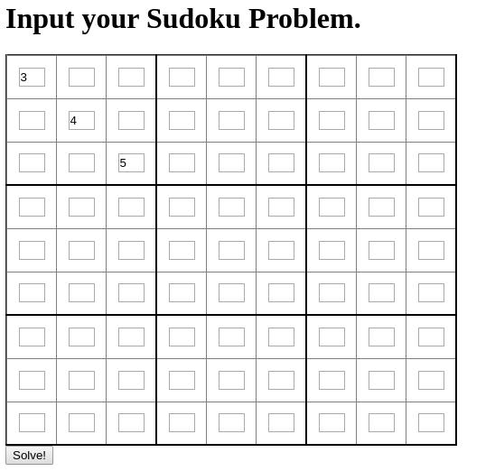
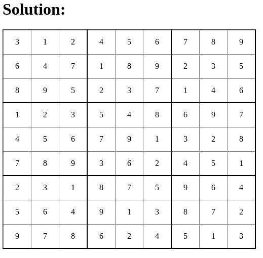

# sudoku-solver

First time making a webapp in clojure.
Practice for upcoming projects

## Usage

```
lein run [port-number]
```
You will see the input page:  
  
Clicking solve will bring you to:  
  

Currently the solver uses brute-force. A more sophisticated implementation may come in the future.
## License

Copyright © 2019 FIXME

This program and the accompanying materials are made available under the
terms of the Eclipse Public License 2.0 which is available at
http://www.eclipse.org/legal/epl-2.0.

This Source Code may also be made available under the following Secondary
Licenses when the conditions for such availability set forth in the Eclipse
Public License, v. 2.0 are satisfied: GNU General Public License as published by
the Free Software Foundation, either version 2 of the License, or (at your
option) any later version, with the GNU Classpath Exception which is available
at https://www.gnu.org/software/classpath/license.html.
